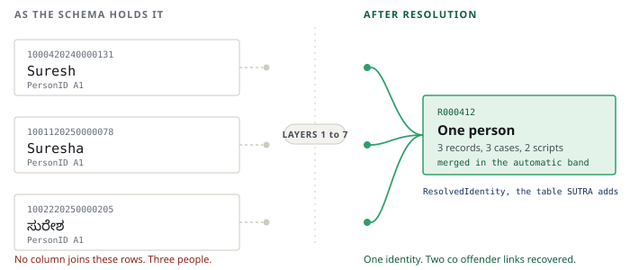
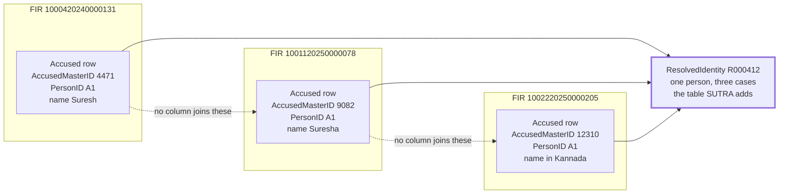
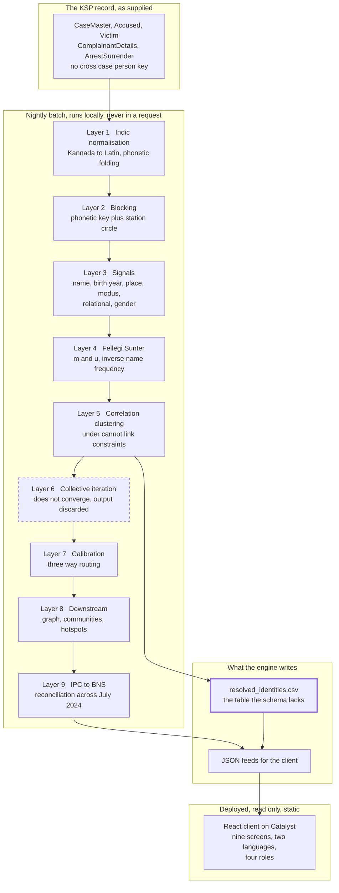
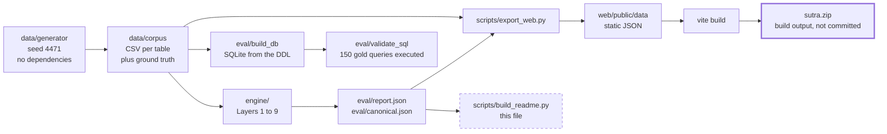
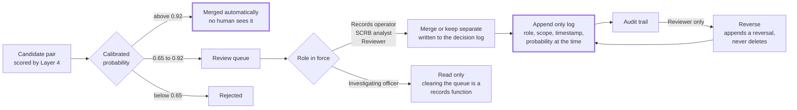

# SUTRA

**Identity resolution for the Karnataka State Police crime record.**
Datathon 2026, problem statement 01.



`0.7901` precision at the shipped cut &nbsp;&nbsp;
`0.9508` at the automatic merging cut &nbsp;&nbsp;
`5,000` cases &nbsp;&nbsp;
`30` decision records &nbsp;&nbsp;
`160` tests

---

## The finding

The problem statement asks for criminal network analysis and repeat offender
tracking. Neither can be computed from the KSP schema as supplied, and the reason
is one missing column.



`AccusedMasterID` is a primary key on the row, not on the person. `PersonID`
holds A1, A2, A3, which is a sort label inside one FIR. The row carries no
father's name, no address, no phone and no biometric key. Three appearances of
one man are three unrelated rows and nothing in the schema says otherwise.


So before anything can be analysed, the person entity has to be constructed. That
construction is what SUTRA is, and how much of it is recoverable is what this
repository measures.

---

## The result

Measured on 5,000 synthetic cases at seed 4471,
pairwise against ground truth over every pair of accused rows in the corpus.

### Two products from one model

The operating point is a policy choice about the cost of a wrong merge against
the cost of a missed one. It is not a property of the method and this project
does not get to make it, so both are published side by side.

| | Precision | Recall | F1 | F0.5 | Cut | Merges | For |
|---|---|---|---|---|---|---|---|
| **Deployable** | **0.9508** | 0.1676 | 0.2849 | **0.4914** | 9.67 | 1,851 | automatic merging |
| **Investigative** | **0.7901** | 0.3692 | 0.5033 | **0.6434** | 6.69 | 4,908 | generating review candidates |

A false merge asserts two people are one and propagates into every downstream
product. A missed merge leaves the record where it already was. So **F beta at
0.5, which weights precision twice as heavily, is the correct objective for this
domain**, and the engine's decision threshold now implements that rather than
only reporting it. See ADR 028.

False merge rate on the automatic band alone, which is the band where nobody
looks: **0.0392**, 58 of
1,481.

### How to read the numbers in this repository

| Role | F1 | What it is |
|---|---|---|
| **headline** | `0.5033` | What the shipped system does on the hostile fixture. This is the answer. |
| **floor** | `0.0696` | Exact name matching, the naive join every other approach starts from. |
| **ceiling** | `0.5937` | This model family fitted from ground truth, on the fixture. Not reachable without labels. |
| **realistic** | `0.6326` | The same system with a 3000 form name vocabulary. A different, easier corpus, which is why it exceeds the fixture ceiling above. Not the headline. |

Any figure that is not the headline carries its qualifier inline, every time. The
headline is the fixture corpus at the threshold the engine derives for itself. No label is used to choose it.

### Against every baseline, on the same corpus, clustered the same way

| Method | Precision | Recall | F1 |
|---|---|---|---|
| english soundex | 0.0075 | 0.5927 | 0.0149 |
| jaro winkler alone | 0.0277 | 0.2917 | 0.0505 |
| exact name match | 0.0496 | 0.1167 | 0.0696 |
| indic phonetic alone | 0.0468 | 0.5369 | 0.0860 |
| **SUTRA** | **0.7901** | **0.3692** | **0.5033** |

**SUTRA reaches 7.2 times the F1 of `GROUP BY AccusedName`.**

---

## Why the remaining gap is not a modelling problem

With m and u fitted from ground truth this model form caps at F1 0.5937, so no linkage method can do much better on the fields this schema provides. SUTRA reaches 85% of it. The remaining gap is not a modelling problem, it is a data collection problem, and it is the argument for adding a person key to the record.

The comparison that makes this concrete arrived by accident.
`ComplainantDetails` carries an `Address` and a `PhoneNumber`. `Accused` carries
neither, and the schema file comments on that asymmetry itself. Run the same
engine over both:

| Table | Oracle ceiling |
|---|---|
| `Accused`, no contact column | **0.5937** |
| `ComplainantDetails`, with a phone number | **0.9781** |

**The difference between a resolvable person and an unresolvable one is not the
algorithm. It is whether the form had a field for a phone number.** The KSP
schema collects contact details for the person reporting a crime and none for the
person accused of one.

That is the argument for adding a person key to the record, and it is the most
useful thing this repository has to say.

---

## Architecture



Layer 6 is drawn with a dashed border because it runs, does not converge, and
its output is discarded. The shipped identity table is Layer 5's. Two mechanisms
were tried to fix it and both failed, which is recorded in ADR 021 and ADR 025,
and the layer is closed.


| Layer | What it does | State |
|---|---|---|
| 0 | Synthetic KSP corpus with identity known by construction, seed 4471 | built |
| 1 | Indic normalisation, Kannada to Latin folding, no English Soundex | built |
| 2 | Blocking on a phonetic key and a station circle key, unioned | built |
| 3 | Six signals plus recorded gender, measured and reported individually | built |
| 4 | Fellegi Sunter, name agreement weighted by inverse frequency | partial, EM does not fit m and u |
| 5 | Correlation clustering under cannot link constraints from the schema | built |
| 6 | Collective iteration, relational evidence recomputed from identities | **does not converge, output discarded** |
| 7 | Isotonic calibration, three way routing at 0.92 and 0.65 | built |
| 8 | Co offender graph, communities, profiles, undetected case ranking | built |
| 9 | IPC to BNS reconciliation across the July 2024 boundary | built |

### What each signal contributes

| Signal | Coverage | AUC | Lift at top level |
|---|---|---|---|
| a  lexical, Jaro Winkler and token set | 100.0% | 0.780 | 15 |
| b  Indic phonetic code agreement | 99.7% | 0.785 | 30 |
| c  implied birth year within two years | 92.5% | 0.931 | 8 |
| d  Haversine and unit hierarchy | 100.0% | 0.872 | 29 |
| e  modus operandi over BriefFacts | 100.0% | 0.747 | 8 |
| f  shared co accused and arresting officer | 64.8% | 0.617 | 5 |

Coverage is where the signal can be computed at all, and AUC is measured only on
those pairs. Lift is the odds a top level agreement carries before any weighting.

### Ablation, where a positive delta means removing the signal helps

| Signal removed | F1 | Delta |
|---|---|---|
| d  Haversine and unit hierarchy | 0.2093 | -0.2940 |
| c  implied birth year within two years | 0.3102 | -0.1930 |
| f  shared co accused and arresting officer | 0.4242 | -0.0791 |
| e  modus operandi over BriefFacts | 0.4291 | -0.0742 |
| a  lexical, Jaro Winkler and token set | 0.5079 | +0.0046 |
| b  Indic phonetic code agreement | 0.5196 | +0.0163 |

Two signals carried positive deltas for most of this project's life, which
indicated correlated evidence being counted twice. Adding an independent channel
and correcting the decision threshold resolved it. See ADR 017 and ADR 028.

### How the data moves



Nothing in the deployed bundle computes anything. The client fetches JSON the
engine already wrote. That is ADR 002 and it is why five of six Catalyst
services show as not used.

The zip is a build output rather than a committed file. `make package` writes it
and `docs/deploy.md` says what to do with it.


---

## The decision layer

Resolution proposes. People decide. The review queue routes every candidate pair
into one of three bands, and the middle band is the one a human clears.



The false merge rate is reported on the automatic band alone, because that is
the band where nobody looks. Errors in the review band are what the review band
is for.


Four roles, and they differ in what they may do as well as in what they may see.

| Role | Sees | Decide | Reverse |
|---|---|---|---|
| SCRB analyst | Every screen, statewide | yes | no |
| Investigating officer | Every screen, one district | no | no |
| Records operator | The review queue only | yes | no |
| Reviewer | Every screen, statewide | yes | **yes** |

The investigating officer cannot decide, and that is deliberate. Approving a
merge writes into the person record, which is a records function rather than an
investigative one.

The decision log is **append only**. A reversal adds an entry naming the one it
reverses, and no role can delete anything, which is what makes the audit trail
true rather than aspirational. That property is asserted by tests rather than by
this paragraph.

**This is client side and per browser.** Decisions live in localStorage.
Persisting to Catalyst Data Store is not built, and neither is server side
enforcement of the roles.

---

## The 150 investigator questions

[eval/gold/questions.yaml](eval/gold/questions.yaml) holds 150 questions an
investigating officer or an SCRB analyst would actually ask, across twelve
investigative shapes, each with gold SQL against the KSP schema. 65
carry a Kannada rendering.

| Band | Questions | Share |
|---|---|---|
| Answerable by the console today | 39 | 26.0% |
| Needs a natural language layer, not built | 58 | 38.7% |
| **Impossible on the raw schema** | **53** | **35.3%** |

**76 of 150, 50.7%, cannot be answered on the KSP schema as
supplied at any level of interface sophistication**, because they need a person
identity that spans FIRs and the schema has none.

All **150 of 150** execute against a SQLite database built from the DDL, and **76 of 76** questions marked as needing a person key genuinely fail when the resolved tables are dropped.

That last sentence is the point. The claim is not that we counted carefully. It
is that the database refuses to run those queries without the table SUTRA adds,
and `make all` proves it on every run.

**Accuracy is not measured and not claimed.** The deck said 74 per cent correct.
Answering these from free text needs a language layer that does not exist.

---

## The same gap in all three person bearing tables

`Accused` is not the only table holding a person with no key that survives across
FIRs. The same engine, Layers 1 to 5 imported from the same modules, was run over
all three.

| Table | Rows | Actual people | Hidden by fragmentation | F1 | Oracle |
|---|---|---|---|---|---|
| `Accused.csv` | 7,611 | 3,840 | 3,771 | **0.5033** | n/a |
| `Victim.csv` | 688 | 544 | 144 | **0.0000** | 0.4839 |
| `ComplainantDetails.csv` | 5,000 | 3,884 | 1,116 | **0.0047** | 0.9781 |

Across Accused, Victim and ComplainantDetails, 13,299 person bearing rows collapse to 8,268 actual people, and 5,651 same person relationships exist that no join on the raw KSP schema can see.

On `Victim` the engine resolves nothing. Three remedies were tried and all
returned exactly 0.0000. That table carries a name, an age, and three columns
this project refuses to read. See ADR 024 and ADR 026.

---

## How much of this is the fixture

Every headline above is measured on a deliberately hostile corpus. Three sweeps
say how much of the result is the fixture rather than the method.

### Name vocabulary

| Name forms | Reduction ratio | Precision | F1 |
|---|---|---|---|
| 86, the shipped fixture | 0.8897 | **0.5770** | 0.5117 |
| 300 | 0.9379 | **0.7303** | 0.5828 |
| 1,000 | 0.9611 | **0.7706** | 0.6110 |
| 3,000 | 0.9731 | **0.8427** | 0.6326 |

Precision moves from 0.5770 to 0.8427 as the name pool widens from 86 forms to 3,000. Pairs completeness barely moves, so blocking finds the same true pairs throughout. What changes is how much rubbish it finds alongside them. **The headline is not replaced.** It stays at the hostile fixture, and this sweep establishes that it is a floor.

**This study is stale.** It was measured on an earlier corpus, and `scripts/check_freshness.py` labels it wherever it appears rather than letting it read as current.

### Corpus size

| Cases | Accused rows | Candidate pairs | Base rate | Precision | F1 |
|---|---|---|---|---|---|
| 5,000 | 7,611 | 3,194,221 | 0.003226 | 0.5770 | 0.5117 |
| 10,000 | 15,276 | 12,688,139 | 0.001558 | 0.4434 | 0.4336 |
| 15,000 | 22,956 | 28,412,208 | 0.001079 | 0.3561 | 0.3870 |

F1 moves by **-0.1247** across the sizes measured. The full 150,000 case
corpus was **not** run. At that size blocking proposes **3,048,808,835 candidate
pairs** over 230,369 accused rows, which is a compute wall and is reported as
one. Candidate pairs grow as `n^1.98` in accused rows.

### Recorded gender, and what a signal is worth when the field is dirty

The gender channel was first measured on a corpus where gender could not be
wrong, because the generator copied it verbatim onto every row of a person. That
was published as a finding and it was arithmetic. The corpus now models a
recording error rate of 1.1%, and the sweep
says what the channel is actually worth.

| Error rate | Rows flipped | F0.5 gain | True pairs contradicted |
|---|---|---|---|
| 0.000 | 0 | +0.0092 | 0 |
| 0.005 | 48 | +0.0072 | 140 |
| 0.012 | 89 | +0.0053 | 255 |
| 0.020 | 141 | +0.0052 | 398 |
| 0.050 | 348 | +0.0045 | 929 |
| 0.100 | 752 | -0.0021 | 1,834 |

At the shipped rate the channel is worth **+0.0053** F0.5, roughly
half the original claim, and it goes negative past the highest rate that still
helps. That is a real operating limit worth handing to a department: if the
gender field is wrong more than about one row in twelve, do not match on it. See
ADR 030.

---

## Downstream, on the resolved identities

| | |
|---|---|
| Co offender edges | 4,576 |
| Edges that exist only after resolution | **1,401**, 30.6% |
| Communities, modularity | 1,141, 0.9973 |
| Undetected case ranking, hit at 1 | 0.2067 |
| Undetected case ranking, hit at 10 | 0.5200 from a pool of 5,284 |
| Naive undercount across the July 2024 BNS transition | **54.19%** |
| Resolved identities | 5,284 |

Blocking reduction ratio 0.8897, pairs
completeness 98.12%. That
completeness is a hard ceiling on recall for every layer after Layer 2.

---

## Reproduce

```
pip install -r requirements.txt
make all
```

That runs generate, audit, block, resolve, persons, downstream, reconcile, eval,
questions, the SQL validation, the export and the document generators in order,
from an empty corpus, in about six minutes.

```
make dev            the application on http://localhost:5173
make test           160 unit tests
make check          Makefile, source encoding and report freshness
make validate-sql   execute all 150 gold queries against real SQLite
make package        the Catalyst deploy bundle
```

Inside `web/`, `npm run check` runs the typecheck, the contrast gate, the Kannada
interface checks, the decision layer checks, and a server side render of every
screen in both languages, under four roles, with and without a district scope.

One test is not in the count above because it does not run by default. It copies
the source tree into a temporary directory with no corpus, runs the chain from
empty, and asserts the headline comes back identical.

```
SUTRA_COLD_CLONE=1 python -m unittest tests.test_cold_clone -v
```

**Every figure in this README is written out of that run** by
`scripts/build_readme.py`. Nothing here is typed by hand, and the cold clone test
asserts that `make all` actually regenerates it.

---

## Benchmark

[benchmark/](benchmark/) is **IERB-P, the Indic Entity Resolution Benchmark for
police records**. A public task anyone can submit to: one command to generate the
corpus at a fixed seed, a documented gold set, a reference baseline to beat, a
scorer, and a leaderboard on which SUTRA is one entry rather than the owner.

```
cd benchmark
./generate.sh
python baseline.py --corpus corpus --out baseline_output.csv
python score.py baseline_output.csv
```

Data and gold set CC BY 4.0, code MIT. Every entry on the leaderboard is
currently ours, which [the leaderboard says plainly](benchmark/leaderboard.md) is
a weakness rather than a strength. It becomes a benchmark when someone else
appears on it.

---

## What is not built

**The 150 question gold set exists and its accuracy does not.** Answering the
questions from free text needs a natural language layer. No language model runs
anywhere in this system, so there is nothing to run the set through. The deck
claimed 74 per cent correct. That figure has no measurement behind it and is not
repeated.

**The query console is structured, not natural language.** You pick a question
and fill in its parameters, and it shows you the SQL it stands for.

**Kannada is interface translation only.** Navigation, panel titles, column
headers, status words and buttons. Explanatory prose stays in English, because a
machine assisted rendering of a technical argument would be worse than English
for a reader who has both. Kannada natural language querying and Kannada speech
are not built. The Kannada that changes a result is in Layer 1, where a name
written in Kannada folds to the same blocking key as its Latin spellings.

**Role scoping is a client side view filter.** It genuinely filters, and the
counts move with it, but the role comes from a dropdown and the JSON is served in
full. Catalyst Authentication and server side enforcement are both not built.

**Decisions live in one browser.** The review queue writes to localStorage. Two
officers on two machines do not see each other's work and clearing site data
clears the audit trail. Persisting to Catalyst Data Store is not built.

**Splink, RapidFuzz, Polars, leidenalg and sentence transformers are not used.**
The linkage model, the Indic phonetic folding and the string metrics are written
directly. That buys one specific thing: every weight in a merge score traces to a
fitted m and u, can be shown to an investigator as a list of contributions that
sums to the total, and can be argued with. A merge an officer cannot interrogate
is a merge they should not act on.


---

## What went wrong, published at the same size as what went right

This repository publishes its failures at the same size as its results, and the
list below is not the marketing version.

**Layer 6 does not converge.** It oscillates and stops at a cap. Damping was
swept at three factors and made it worse. Best partition selection on the
engine's own objective was measured across three corpus seeds, improved one and
hurt two, mean change 0.0000. The layer is closed and its output is discarded.

**Expectation maximisation does not fit m and u** on this corpus. It converges to
a solution that defines a match as an identical name string. m is estimated from
unsupervised leave one out seeds instead and EM fits only the mixing proportion.

**Victim resolution returns exactly zero.** Three remedies were tried, including
transferring the prior from the accused table and pooling all three tables. All
returned 0.0000. The table has a name, an age and nothing else.

**The corpus is synthetic and we generated it.** The oracle that bounds the
result is ours too. Every headline is measured on one fixture whose difficulty we
chose. No external validation exists and none is claimed.

**Three overclaims were caught and corrected in place.** A README that said it
regenerated when it did not, two studies presented as current that were stale,
and a ceiling stated to bound model families it cannot. A fourth was worse: a
gender channel measured on a corpus where gender could not be wrong, published as
a finding, then corrected by modelling the error rate and measuring again. It was
worth about half what was first claimed.

**36 of the 150 gold SQL queries were broken** when first shipped, referencing
columns that do not exist. They had never been executed. They are now, on every
run, and the build fails if one does not parse.


The full list, claim by claim, with three values and nothing softened, is in
[docs/build-status.md](docs/build-status.md) and on the `/status` screen.

---

## Ethics

`CasteID`, `ReligionID` and `OccupationID` exist in the KSP schema, are
generated into the corpus for fidelity, and are never read by any model, scoring
function or ranking. That is enforced by `engine/policy.py`, which raises rather
than warns, and by a test that fails the build if the guard is removed. When the
engine was extended to `Victim`, which carries all three, the run was made to
assert that the raw header is rejected before the permitted columns are
projected. A control never seen to trip cannot be told apart from one that does
not work.

SUTRA does no individual predictive risk scoring and no behavioural profiling.
The undetected case matcher ranks records already on file against a case that has
already happened. It scores a pair of cases rather than a person, and it persists
nothing about anybody.

The precedent behind that refusal is Chicago's Strategic Subject List, which an
Inspector General audit found had enrolled a very large share of a city while a
RAND evaluation found no effect on victimisation, and the LAPD LASER programme,
discontinued in 2019 after its own Inspector General found the selection criteria
were applied inconsistently. Both are set out in [docs/ethics.md](docs/ethics.md).


---

## Layout

```
data/generator/   synthetic FIR corpus, no dependencies, standalone
data/schema/      DDL mirroring the KSP ER diagram, loaded by eval/build_db
engine/           policy, normalise, block, features, linkage, cluster,
                  calibrate, downstream, reconcile
eval/             report.py, questions.py, build_db.py, validate_sql.py
web/              React, TypeScript, Vite. Nine screens, no mock data
benchmark/        IERB-P, the public task, gold set, baseline and scorer
docs/             architecture, decisions, ethics, build status
```

## Links

- Deployed, [https://sutra-gfrnnril.onslate.in/](https://sutra-gfrnnril.onslate.in/)
- Build status, [docs/build-status.md](docs/build-status.md)
- Architecture, [docs/architecture.md](docs/architecture.md)
- Decisions, [docs/decisions.md](docs/decisions.md), 30 ADRs
- Ethics, [docs/ethics.md](docs/ethics.md)
- Deployment, [docs/deploy.md](docs/deploy.md)
- Benchmark, [benchmark/README.md](benchmark/README.md) and
  [the leaderboard](benchmark/leaderboard.md)

<sub>Generated by scripts/build_readme.py from the run of
2026-07-28T22:24:41+00:00. Do not edit by hand.</sub>
